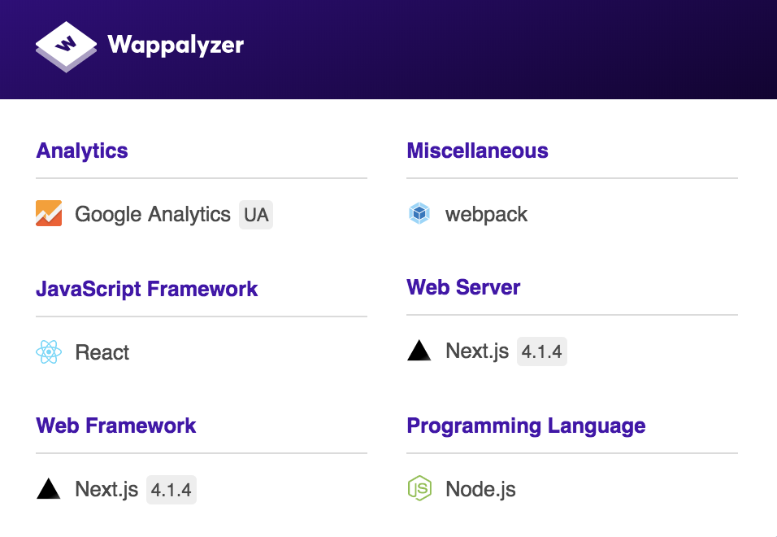
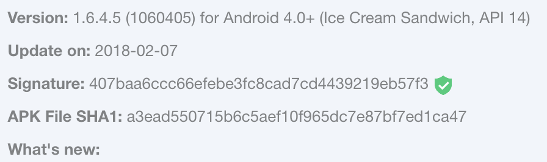
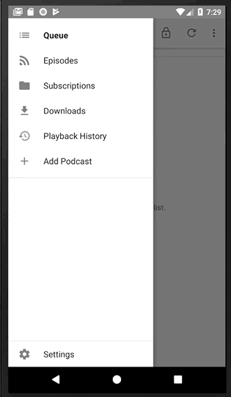
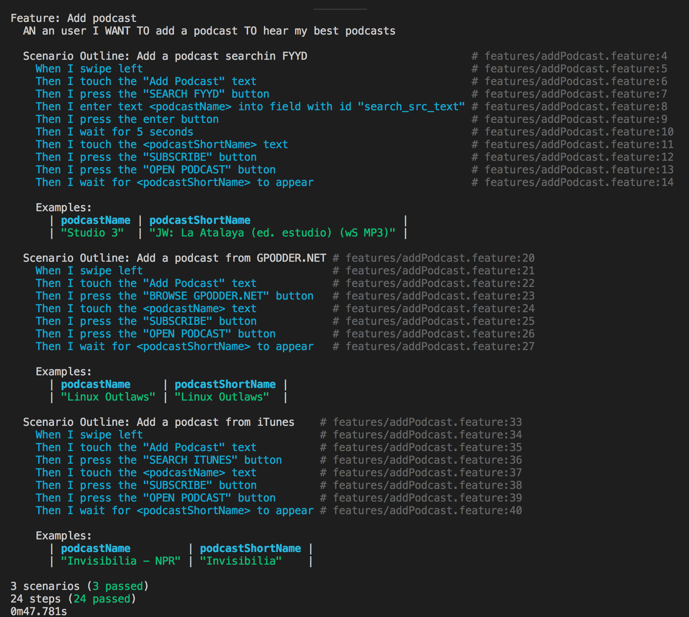
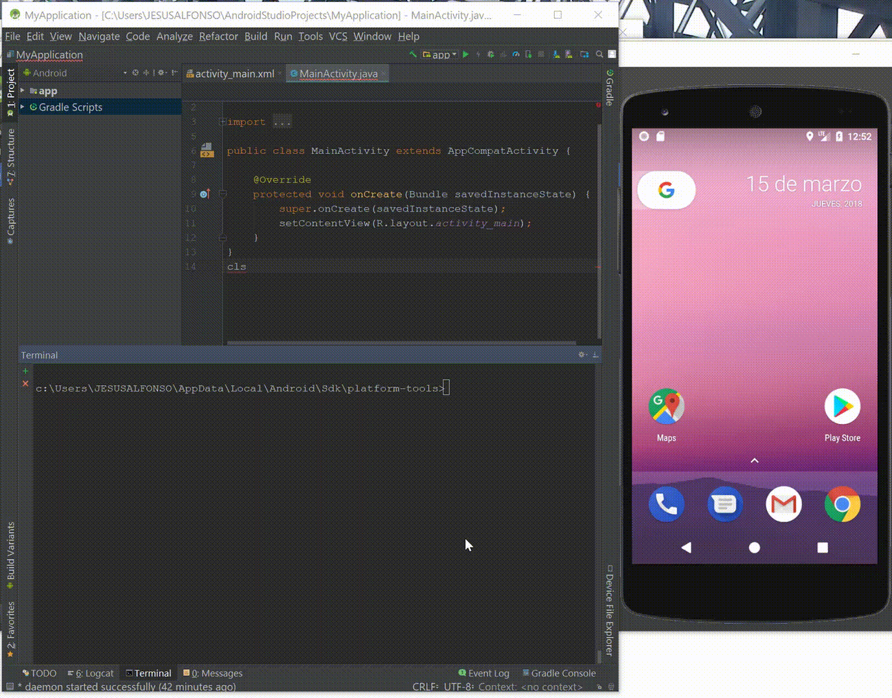

# Estrategia de Pruebas Parcial 1

DIEGO ALFONSO PRIETO TORRES

ALFONSO DE JESÚS ARDILA RIOS

## Contexto

### Objetivo

* Realizar Pruebas exploratorias sobre la aplicación movil AntenaPod para conocer cuales son sus principales funcionalidades.
* Realizar Pruebas automatizadas funcionalidades rapidas del flujo completo "comentar profesor" para la aplicación Web de losestudiantes.com 
* Encontrar "corner case" de la aplicación de AntennaPod, para lograrlo se va a realizar un proceso de Random testing.

### Presupuesto

* Se cuenta con un equipo de dos ingenieros, cada uno con 2 horas y veinte minutos para realizar esta iteración.
* Las maquinas personales de cada ingeniero estarán disponibles para la ejecución de la iteración.

### Niveles y Tipos de Pruebas

**Nivel Sistema**

Dado que ya se cuenta con las apliaciones desarrolladas realizaremos pruebas a nivel de sistema.

Dentro de los tipos de pruebas que realizaremos dentro de este módulo se encuentran:

* Manual: En la fase exploratoria.
* Funcional: Probando los casos de uso seleccionados.
* Automatizadas: Se ejecutarán pruebas automatizadas sobre algunos casos de uso de las apliaciones.
    * Para la aplicación de Los Estudiantes se va a automatizar el caso de uso **commentar profesor** usando `Cypress`, el principal objetivo es validar que el formulario funciona de forma correcta evitando que un usuario comente si no ha completado toda la información.
    * Para la aplicación de AntennaPod se realizara una prueba de RandomTesting usando un monkey testing de Android con ejecuciones aleatorias.

**Nivel Aceptación**        

* Manual: En la fase exploratoria, con la aplicación de AntennaPod instala en los dispositivos moviles de los desarrolladores (ambiente de usuario).
* Automatizadas: Se escribinar escenarios de pruebas auto-documentados usando Gherkin, dichas pruebas son ejecutables usando cabalash. La característica seleccionada a probar es **Adicionar un nuevo podcast**

### Infraestructura de Pruebas

* Maquinas personales de Diego Prieto y Alfonso Ardila (MacBook Pro 16GB Ram, 512 GB estado solido, core i7 y Surface 8GB Ram, Core i5, 256 GB Estado solido).
* APK de la aplicación movil AntenaPod provista por el profesor.
* Página de producción de losestudiantes.com
* Celulares Android con SO Oreo de cada uno de los desarrolladores (Samsung S4 y Sony Z3).
* Emuladores virtuales a través de Android Studio (Nexus 5X SO Oreo)

### Calendario e integración con desarrollo

* No se va a realizar integración con desarrollo debido a que las pruebas se están realizando sobre AUT's que ya están terminados y compilados.
* Por otro lado en el caso de AntennaPod se realiza un proceso de BDT, debido a que se están construyendo pruebas de aceptación automatizadas después de que el proceso de desarrollo ha terminado.

## Caracteísticas de las App

### Los Estudiantes

Apliacición "losestudiantes.co" es una palicación web a través de la cual los estudiantes de la Universidad de los Andes y la Nacional se inscriben y les permiten busca y calificar a los profesores y sus clases anónimamente, además de eso la aplicación cuenta con la opción de ver estadisticas, formar debates etc. Todo esto con el objetivo de que los estudiantes puedan preparar de la mejor manera sus clases seleccionando mejor a sus profesores.

La aplicación esta desarrollada usando ReactJs y 3D.js y no tiene ninguna restricción para poder ser accedida desde cualquier browser.

**Exploración maual del caso de uso "comentar profesor" en Los Estudiantes**

En este caso no deja comentar porque el mail no es verificado

En este caso si deja comentar porque el mail es valido.

En ambos casos se puede notar los fallos del formulario cuando los slider de calificación están debajop de 1.5

**Ejecución de pruebas automatizadas sobre Los Estudiantes para el caso de prueba comentar profesor**

### AntenaPod

Aplicación "AntenaPod": Apliación desarrollada para dispositivos con S.O. Andorid

AntennaPod is un gestor y reproductor de podcast que te da acceso instantáneo a millones de podcast gratuitos y de pago, desde podcasters independientes a grandes estaciones como la BBC, NPR y CNN. Agrega, importa y exporta las fuentes de manera sencilla usando el listado de iTunes, archivos OPML o las URL de tipo RSS.

**Automatización caso de uso "Add podcast" de AntennaPod usando Cabalash**

**Ejecución de Random Testing sobre AntennaPod usando un monkey con eventos aleatorios**
* Se instalo la apliación a través de adb:
   * adb install C:\Users\JESUSALFONSO\Documents\de.danoeh.antennapod_1060405.apk
* Comando para la ejecucioón de la prueba:
   * adb shell monkey -p de.danoeh.antennapod -v 10000 -s 200
   * Se le indica el paquete sobre el cual se quiere ejecutar la prueba (de.danoeh.antennapod), la cantidad de eventos aleatorios que se quieren realizar (10000) y una semilla (200) para que se generen los mismos eventos para tratar de reproducir un error en caso de que ocurra.

